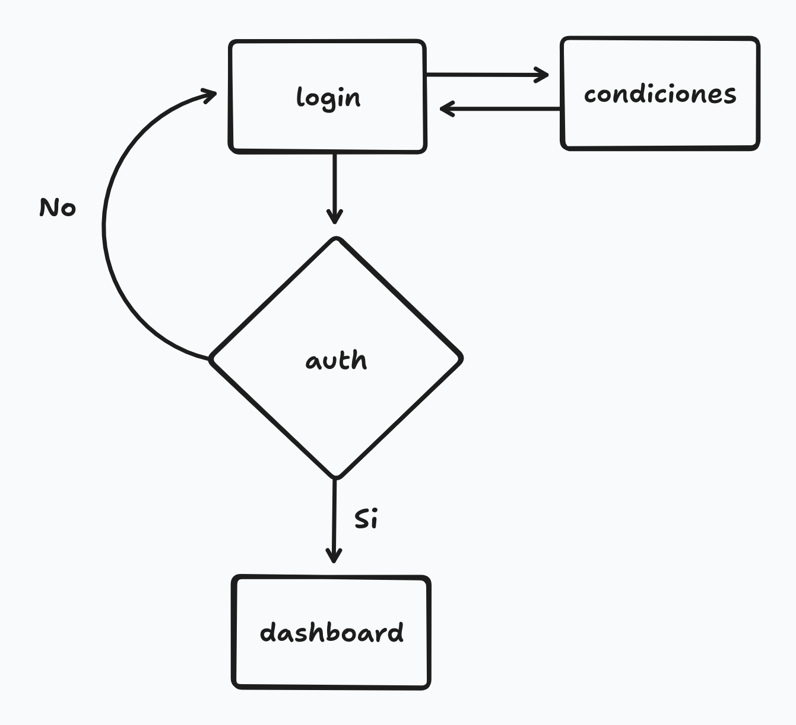
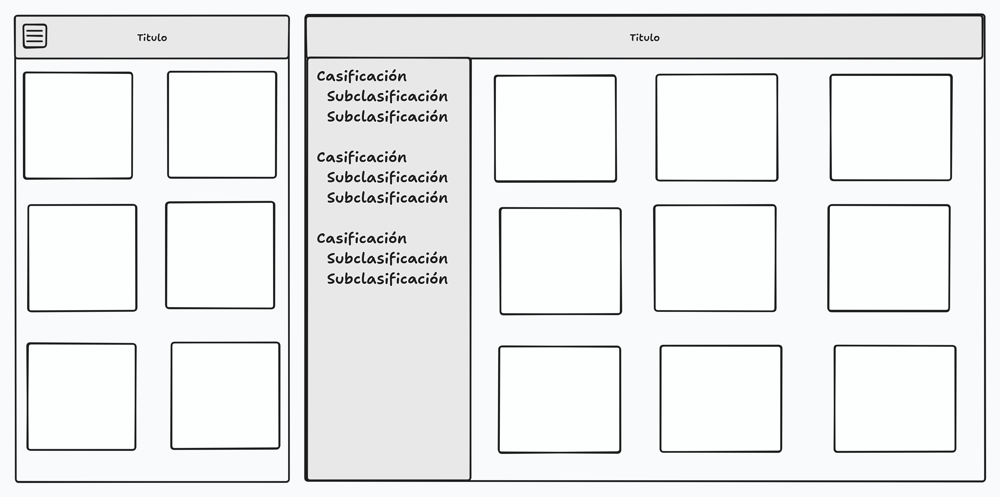

# Sitio privado 

## Situación profesional

Crear desde cero un sitio de fotos con un control de acceso sencillo.

## Profesión:

Desarollador Frontend.

## Competencias

Crear una interfaz de usuario web estática y adaptable.

Crear un algoritmos sencillo para autenticación.

## Necesidad

Necesitamos compartir unas fotos categorizadas, y proteger el acceso con usuario y contraseña.

## Modalidad pedagógica

Trabajo individual. Aprendizaje autónomo.

## Modalidad de evaluación

Revisión de entregables por parte del profesorado.

## Entregables

HTML y recursos (imágenes y css) en un repositorio github personal.

Para hacer la entrega, el alumnado deberá publicar el enlace al repositorio en el canal deberes-y-entregas de discord.

## Criterios de rendimiento

- Toda la funcionalidad cubierta.
- Código correctamente indentado y limpio.
- Todos los tags correctamente abiertos/cerrados (https://validator.w3.org/).
- Comentarios de código donde se necesiten.
- Ficheros no-html en directorios aparte.
- Se valorará si se puede ver el avance a través de los commits.

## Descripción de las tareas a realizar:

Realizar una web con un login que siga el siguiente diagrama de flujo:

La página en la que se hace login, debe ser responsiva, y parecerse a esto:

El boton con el texto "Login" no se podrá pulsar hasta que no se acepten las condiciones.

El dashboard ha de ser una página responsive que muestre fotografías según una clasificación:

